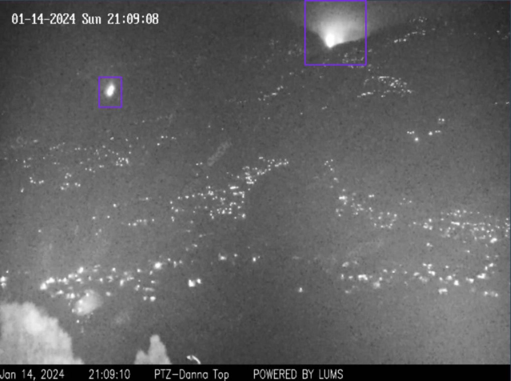

# YovaClip: A Multi-Model Approach to Forest Fire Detection

The increasing frequency and severity of forest fires
presents significant threat to both human lives and natural
ecosystems (flora and fauna). Given this problem, this project
aims to provide a novel deep learning-based approach for the
early detection of forest fires. The approach utilises the benefits
of Large Multi-Models (LMM) and the You Only Look Once
(YOLO) model for accurate and robust forest fire detection from
surveilling cameras in forest areas. This methodology, leveraging
the comprehensive feature extraction of LMMs and real time object detection of YOLO, aims to improve accuracy and efficiency
of fire and smoke detection in these environments. The fusion
of these 2 mechanisms allows them to compliment each other
and filling in the gaps/weaknesses of both models. By detecting
these incidents in their early stages, our solution aims to enable
mitigating the risk of catastrophic wildfire outbreaks. Through
rigorous experimentation and evaluation, we demonstrate the
effectiveness and reliability of our proposed method, offering
a promising tool for forest fire management and conservation
efforts.

## YovaCLIP Pipeline

